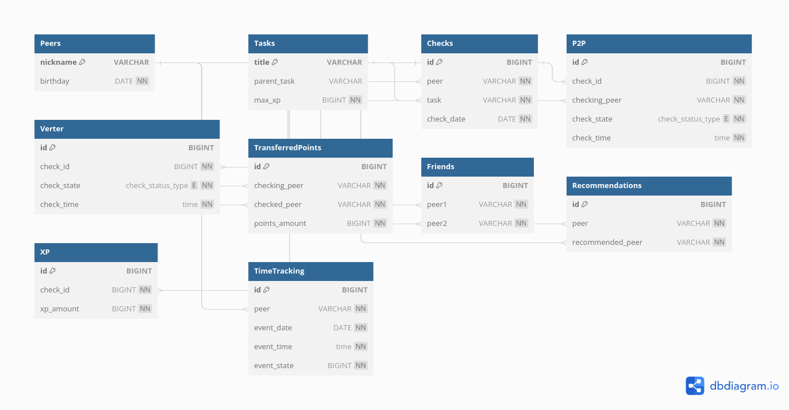

# StudentsInfoDB

Структура базы данных для проекта информации о студентахю

## Содержание

В проекте реализована структура базы данных с различными функциями, процедурами и триггерами.
Также есть импорт и экспорт в файлы csv.

## Структура

[диаграмма](https://dbdiagram.io/d/64f6d45202bd1c4a5ef99d2c)

Описание процедур, функций и триггеров — в комментариях в самом коде.

1. Чтобы создать базу данных `make create`
2. Чтобы заполнить базу данных `make fill`
3. Чтобы удалить базу данных, выполните команду make drop.
4. Создать и заполнить базу данных `make`
   
